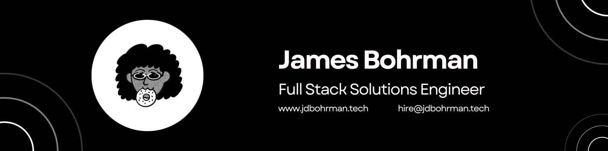

# Hey there, I'm James 👋

I'm the Founder and CEO of Portcullis, the Clickhouse solution studio for petabyte-scale ideas. I love solving problems and helping both our clients and the greater Clickhouse ecosystem build solutions that move data as fast and reliably as possible. We're a team of builders and solvers, so when we aren't doing client work, we're working on various projects on the Clickhouse ecosystem. 

## Find me around the web 🌎: 
- Schedule a Portcullis <a href="https://cal.com/team/portcullis/intro-call">intro call</a> 📆
- View my writing on the <a href="https://www.runportcullis.co/blog">Portcullis Blog</a> ⚙️
- Find me on <a href="https://www.linkedin.com/in/jdbohrman/">LinkedIn</a> 💼
